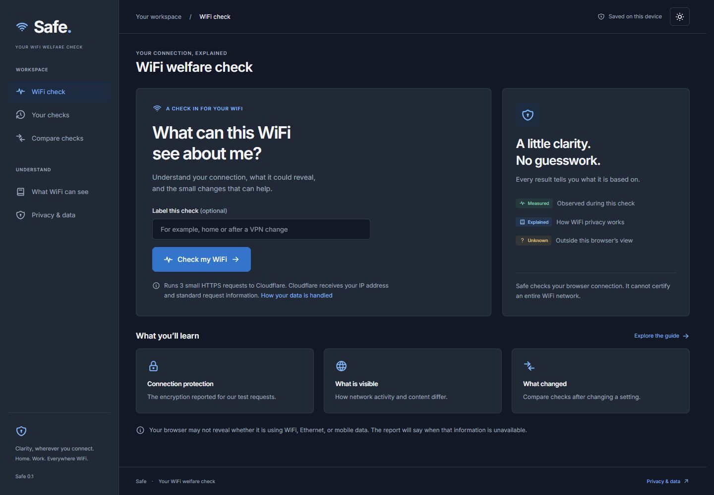

# Safe

**Your WiFi welfare check.**

[Open Safe](https://safe.alx21.chatgpt.site)

Safe helps a visitor understand what a WiFi connection could reveal. It runs three small HTTPS requests from the user's browser, explains the evidence, saves a local history, and compares checks after a change.

Safe is a working browser application. It does not certify WiFi safety, scan other devices, identify people, read their traffic, or establish what a network operator records.



## What works

1. Start a check with an optional label.
2. Inspect successful HTTPS responses, reported TLS versions, request timings, and available browser connection information.
3. Read findings explicitly labeled Measured, Explained, or Unknown.
4. Compare two checks, including public IP observations when both remain available in the current session.
5. Reopen the latest 20 reports after a reload. Public IP addresses are omitted from persistence and exports.
6. Export a report, remove or clear local reports with undo, switch themes, and use the app on narrow screens.

## Run locally

Requires Node 22.12 or newer and pnpm 11.19.0.

```sh
pnpm install --frozen-lockfile
pnpm dev --host 127.0.0.1 --port 5173
```

Open `http://127.0.0.1:5173/`. No API key, account, database, or backend is required.

```sh
pnpm build
pnpm test
pnpm audit --prod
pnpm preview --host 127.0.0.1 --port 4173
```

The production client is emitted to `dist/client`. A compatible static asset Worker and hosting metadata are also emitted to `dist/server` and `dist/.openai`. The public website is hosted through Sites. GitHub stores the source; pushing to GitHub does not automatically deploy the website.

## Honest measurements

The browser makes three sequential requests to `https://www.cloudflare.com/cdn-cgi/trace`. Each request has a six second timeout and an 8 KiB response limit. Requests omit credentials and referrer information, reject redirects, and request an uncached response. Responses must contain a valid IP address, the HTTPS scheme, and a supported TLS version. Unexpected HTML or an incomplete diagnostic is inconclusive.

Only selected fields are used: IP address, TLS version, HTTP version, and the endpoint's SNI report. IP addresses remain in memory only. Cloudflare receives the ordinary request metadata described in its privacy policy. Your website host also receives normal page requests. Safe's application includes no advertising or analytics.

Request duration includes browser and service overhead. It is not a WiFi signal or throughput measurement. Browser connection estimates such as `4g` do not identify the transport and are not presented as WiFi detection. A local HTTP page is reported as HTTP even though localhost may count as a secure context.

A successful HTTPS test does not validate all applications, router configuration, device trust roots, DNS encryption, ECH coverage, VPN coverage, or operator logging. Failure does not prove an attack. An IP change does not prove that a VPN is enabled. IP comparisons become unavailable after reload or when the address changes within a check.

The Cloudflare diagnostic is an external dependency, with no availability guarantee from Safe. If its response format or CORS behavior changes, tests fail visibly as inconclusive rather than being replaced with fabricated values.

## Template and attribution

Safe uses the actual **Tabler 1.5.1** CSS and **Tabler Icons 3.46.0**, adapted from the official sidebar dashboard. It also bundles Inter 5.3.0 font files locally.

The template appears as item 17 in Spruko's published [20 Best Free Admin Dashboard Templates](https://sprukomarket.com/blog/20-best-free-admin-dashboard-templates-for-developers). This is an editorial template listing, not a verified ranking of template websites.

[Official Tabler source](https://github.com/tabler/tabler) · [Template](https://tabler.io/admin-template) · [Visual reference](https://preview.tabler.io/layout-vertical.html)

Required third party notices are preserved in `third-party`. Publishing this repository does not apply the dependencies' licenses to Safe's original application code. No separate open source license for that code has been selected.

## Verification

See [VERIFICATION.md](VERIFICATION.md), [design-qa.md](design-qa.md), and [SECURITY.md](SECURITY.md). Automated tests use fictional documentation IP addresses and deterministic failure scenarios. Live browser verification is recorded without publishing real addresses or check payloads.

## Sources behind the explanations

1. [EFF: Encryption and metadata](https://ssd.eff.org/module/what-should-i-know-about-encryption)
2. [EFF: Choosing a VPN](https://ssd.eff.org/module/vpn.html)
3. [Cloudflare: Encrypted Client Hello](https://developers.cloudflare.com/ssl/edge-certificates/ech/)
4. [MDN: NetworkInformation](https://developer.mozilla.org/en-US/docs/Web/API/NetworkInformation)
5. [Cloudflare privacy policy](https://www.cloudflare.com/privacypolicy/)
