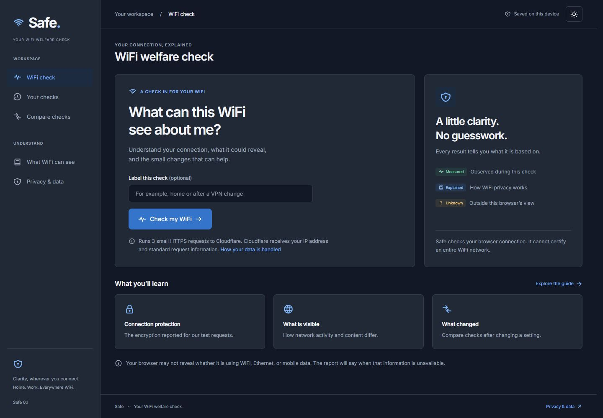

# Safe

**Your WiFi welfare check.**

[Open Safe](https://safe.alx21.chatgpt.site) · [User guide](docs/user-guide.md) · [Development guide](docs/development.md) · [Report a bug](https://github.com/agammann/safe/issues)

Safe 1.0.0 helps you understand what your WiFi connection could reveal. Open the website, run a check, and get a plain language report based on three small HTTPS requests from your browser.

No installation, account, or API key is needed to use the public website.



## Use Safe

1. Connect your device to the WiFi you want to check.
2. Open [Safe](https://safe.alx21.chatgpt.site) and optionally give the check a short label. Avoid personal information in labels.
3. Select **Check my WiFi**. Safe sends three requests to Cloudflare, which receives your IP address and ordinary request information.
4. Read the report. Each finding is labeled **Measured**, **Explained**, or **Unknown**.
5. Use **Your checks** to reopen a report, or run another check and open **Compare checks** to see what changed.

Keep the page open between checks if you want to compare public IP observations. Addresses are held in memory and are unavailable after a reload. An IP change alone does not prove VPN protection.

See the [user guide](docs/user-guide.md) for comparisons, exports, clearing reports, and troubleshooting.

## What the results mean

| Label | Meaning |
| --- | --- |
| Measured | An observation from this check, such as successful HTTPS responses, reported TLS versions, or request duration. |
| Explained | General guidance about what WiFi operators may be able to observe. |
| Unknown | Something this browser check cannot establish, such as what the operator records or whether all device traffic uses a VPN. |

Safe does not certify that a WiFi network is safe. It cannot inspect router settings, identify other users, read their traffic, or verify protection across every app. Request duration is not a signal strength or download speed measurement. A failed request does not prove an attack.

## Your data

The latest 20 reports are stored in your browser. Public IP addresses are omitted from saved reports and JSON exports. Optional labels and other report details remain in those files, so review an export before sharing it.

Safe includes no application analytics or advertising. Cloudflare receives diagnostic requests, and the website host receives normal page requests. Reports are not synchronized between devices, browsers, or the public and local versions of Safe. Read the [privacy and security details](SECURITY.md).

## Run locally

Use this path to develop Safe or run your own copy. To simply use Safe, open the public website above.

Install [Git](https://git-scm.com/downloads) for a clone, [Node.js 24](https://nodejs.org/en/download), and **pnpm 11.19.0**. Use Node.js 24.15.0 or later; Node.js 24.19.0 is used for local verification. If pnpm is not installed, run `npm install --global pnpm@11.19.0` after installing Node.js. See the [pnpm installation guide](https://pnpm.io/installation) for other installation methods.

Run these commands in a terminal, one at a time:

```sh
git clone https://github.com/agammann/safe.git
cd safe
pnpm install --frozen-lockfile
pnpm dev --host 127.0.0.1 --port 5173 --strictPort
```

Open **http://127.0.0.1:5173/**. Leave the terminal running while using the app. Press **Ctrl+C** to stop it. Internet access is required for installation and live diagnostic requests. No `.env` file or backend setup is required.

To verify and preview a production build, stop the development server or use a second terminal in the `safe` directory:

```sh
pnpm build
pnpm test
pnpm audit
pnpm preview --host 127.0.0.1 --port 4173 --strictPort
```

Open **http://127.0.0.1:4173/** after the preview starts. This is a local preview; it does not publish a website. See [development and deployment](docs/development.md) for the file layout, available commands, and hosting requirements.

## Source release, updates and recovery

Download `safe_1.0.0_source.zip` and its checksum from [Releases](https://github.com/agammann/safe/releases). Compare the SHA256 value with `Get-FileHash safe_1.0.0_source.zip -Algorithm SHA256` in PowerShell, or `sha256sum -c safe_1.0.0_source.zip.sha256` on Linux. Extract it to a new folder, open `safe-1.0.0`, then run the same frozen install, build and preview commands above. Git is not required to use the extracted source; packaging a new release requires a clean Git checkout.

For updates, export any reports you need, stop the old local server and install the new release in a separate folder. Keep the same browser and website origin to retain saved history. Public and local versions use different storage. Reload open tabs after an update. Keep your previous source folder until the new build works so you can run it again if needed.

If saved data is unreadable, Safe leaves the existing bytes alone and keeps new checks in the current session. Export those new reports before reloading. Open **Privacy & data** and select **Reset saved data** only when you want to discard unreadable history and enable saving again. If storage is blocked, use browser settings to allow it or continue using session reports. See the [user guide](docs/user-guide.md#troubleshooting) for diagnostic failures and the [development guide](docs/development.md#common-setup-problems) for setup problems.

## Project documentation

| Document | Use it for |
| --- | --- |
| [User guide](docs/user-guide.md) | Running checks, interpreting results, comparisons, and troubleshooting. |
| [Development guide](docs/development.md) | Local setup details, commands, project structure, and hosting. |
| [Contributing](CONTRIBUTING.md) | Reporting problems and preparing changes. |
| [Security and privacy](SECURITY.md) | Data handling, technical limits, and sensitive reports. |
| [Verification record](docs/verification.md) | Dated checks, publication evidence, and untested environments. |
| [Design review](docs/design-review.md) | The original template adaptation and visual verification. |
| [Third party notices](third-party/README.md) | Component attribution and included licenses. |

## Template and licensing

Safe uses Tabler 1.6.1, Tabler Icons 3.49.0, and locally bundled Inter 5.3.0 fonts. The interface adapts [Tabler's sidebar dashboard](https://preview.tabler.io/layout-vertical.html) for WiFi checks.

Safe's original application code is available under the [MIT license](LICENSE). Third party components retain their own included [license notices](third-party/README.md).
